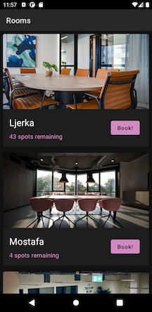
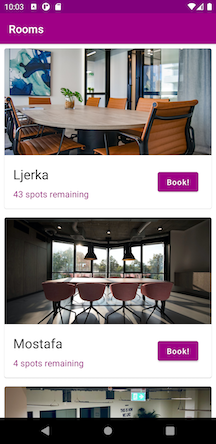

# Rooms
A simple app that simulates showing a list of rooms and booking using Jetpack Compos.

## Technology
* **Repository Pattern** - to have a clear separation between the `UI` and the `Data` layer
* **MVVM** - the project uses a variant of MVVM where a `composable state` is used to manage the UI state. The ViewModel has a `scope` that only lives within a composition and any running coroutines is cancelled when it leaves the composition.
* **Jetpack Compose** - This project showcases how Jetpack Compose can be used to build beautiful UIs.
* **Offline Mode** -  uses `Room` as cache.

## Screenshots
  

## Wishlist
 - **View booked rooms** - a tab or filter to show only booked rooms.
 - **Better configuration change handling** - the project does not save its instance on configuration change but this performance is negligible since the data is always fetch from the room database. But it would be nice if this is handeled well.
 - **Cancel booking** - I'm not sure if cancelling booking is a nice use case. 
 - **Detailed view** - another screen to show the details of the room and be able to book. The information does not really need to have a detailed page, it would just be nice to also showcase navigation in Jetpack Compose
 - **UI tests** - A benefit of Jetpack Compose is easier UI testing by testing composables. This project does not have UI tests yet.